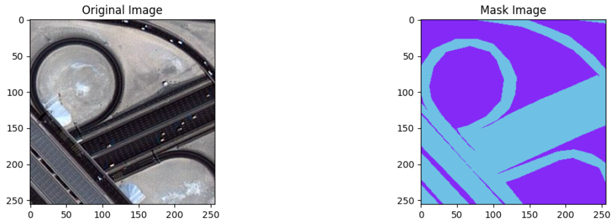
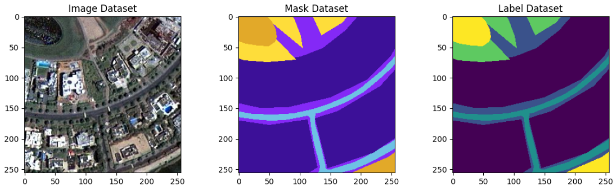
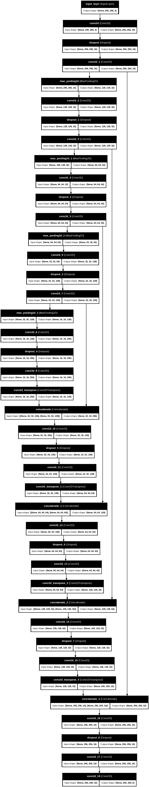
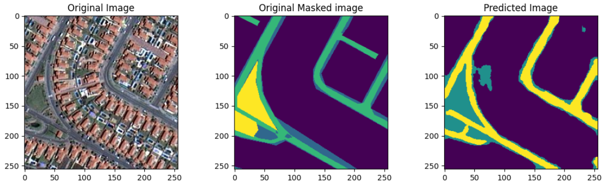

# Satellite Image Classification

[](https://colab.research.google.com/github/Mirjan-Ali-Sha/Satellite-Image-Classification/blob/main/Satellite_Image_Classification.ipynb)

## Table of Contents

1. [Dataset](README.md#dataset)
2. [Model Building](README.md#model-building)
3. [Model Testing](README.md#model-testing)
4. [Conclutions](README.md#conclutions)


## Dataset

I take this dataset from Kaggle Dataset ([Semantic segmentation of aerial imagery](https://www.kaggle.com/datasets/humansintheloop/semantic-segmentation-of-aerial-imagery)).

### About Dataset *(taken from data source)*:
Context:<br>
Humans in the Loop is publishing an open access dataset annotated for a joint project with the Mohammed Bin Rashid Space Center in Dubai, the UAE.

Content: <br>
The dataset consists of aerial imagery of Dubai obtained by MBRSC satellites and annotated with pixel-wise semantic segmentation in 6 classes. The total volume of the dataset is 72 images grouped into 6 larger tiles. The classes are:

1. Building: #3C1098
2. Land (unpaved area): #8429F6
3. Road: #6EC1E4
4. Vegetation: #FEDD3A
5. Water: #E2A929
6. Unlabeled: #9B9B9B

Acknowledgements<br>
The images were segmented by the trainees of the Roia Foundation in Syria.<br>

Tiles are saved like below;
```
'Tile 1'
  |_ images (include 9 RGB images)
  |_ masks (include 9 RGB Mask files)
'Tile 2'
  |_ images (include 9 RGB images)
  |_ masks (include 9 RGB Mask files)
'Tile 3'
  |_ images (include 9 RGB images)
  |_ masks (include 9 RGB Mask files)
'Tile 4'
  |_ images (include 9 RGB images)
  |_ masks (include 9 RGB Mask files)
'Tile 5'
  |_ images (include 9 RGB images)
  |_ masks (include 9 RGB Mask files)
'Tile 6'
  |_ images (include 9 RGB images)
  |_ masks (include 9 RGB Mask files)
'Tile 7'
  |_ images (include 9 RGB images)
  |_ masks (include 9 RGB Mask files)
'Tile 8'
  |_ images (include 9 RGB images)
  |_ masks (include 9 RGB Mask files)
```

### Preparing Dataset
At first I upload all datasets to my Google Drive to smooth file management irrespective of run-time environments (CPU/GPU/Reconnect). The dataset/images are not in consistant size (hieght * width) and also few image size are very big as well. So, I decide to create Patches of 256 * 256 to reduce Memory consumption during training and for that I use `patchify` and I use `sklearn.preprocessing.MinMaxScaler` to Re-Scale only image values (for better accuracy) to 0-1 floating point (it can create more varities). You can see those codes inside the Pyhon Notebook but here I attached those codes for references;
```
from google.colab import drive
drive.mount('/content/drive')
```
```
minmaxscaler = MinMaxScaler()
img_patch_size = 256
dataset_root = '/content/drive/MyDrive/'
dataset_folder = "Dubai_Arial_Datasets"
```
Patches and Dataset Creation:
```
image_dataset = []
mask_dataset = []

for image_type in ['images' , 'masks']:
  if image_type == 'images':
    image_extension = 'jpg'
  elif image_type == 'masks':
     image_extension = 'png'
  for tile_id in range(1,8):
    for image_id in range(1,20): # we can use minimum values as well instead of 20 in range.
      image = cv2.imread(f'{dataset_root}/{dataset_folder}/Tile {tile_id}/{image_type}/image_part_00{image_id}.{image_extension}', 1)
      if image is not None: # as we given the range to avoid 
        if image_type == 'masks':
          image = cv2.cvtColor(image, cv2.COLOR_BGR2RGB) # because imread read images in BGR format (IMREAD_COLOR_BGR)
        size_x = (image.shape[1]//img_patch_size)*img_patch_size
        size_y = (image.shape[0]//img_patch_size)*img_patch_size
        image = Image.fromarray(image)
        image = image.crop((0,0, size_x, size_y))
        image = np.array(image)
        patched_images = patchify(image, (img_patch_size, img_patch_size, 3), step=img_patch_size)
        for i in range(patched_images.shape[0]):
          for j in range(patched_images.shape[1]):
            if image_type == 'images':
              individual_patched_image = patched_images[i,j,:,:]
              # Re-scale Image values 0-1.
              individual_patched_image = minmaxscaler.fit_transform(individual_patched_image.reshape(-1, individual_patched_image.shape[-1])).reshape(individual_patched_image.shape)
              individual_patched_image = individual_patched_image[0]
              image_dataset.append(individual_patched_image)
            elif image_type == 'masks':
              individual_patched_mask = patched_images[i,j,:,:]
              individual_patched_mask = individual_patched_mask[0]
              mask_dataset.append(individual_patched_mask)
```
Plot/Vizualize Dataset Random:
```
# Run this Cell to get new Image
random_image_id = random.randint(0, len(image_dataset))

plt.figure(figsize=(14,8))
plt.subplot(221)
plt.title("Original Image")
plt.imshow(image_dataset[random_image_id])
plt.subplot(222)
plt.title("Mask Image")
plt.imshow(mask_dataset[random_image_id])
```

Label Management:
```
# Define the class names and hex codes in one place
hex_colors = {
    'building'   : '#3C1098',
    'land'       : '#8429F6',
    'road'       : '#6EC1E4',
    'vegetation' : '#FEDD3A',
    'water'      : '#E2A929',
    'unlabeled'  : '#9B9B9B',
}

# Helper to go from '#RRGGBB' → [R, G, B]
def hex_to_rgb(h):
    h = h.lstrip('#')
    return np.array([int(h[i:i+2], 16) for i in (0, 2, 4)], dtype=np.uint8)

# Build a dict of NumPy arrays
class_colors = {f'class_{name}': hex_to_rgb(code)
                for name, code in hex_colors.items()}

# (Optional) unpack into variables if you really want individual names
class_building, class_land, class_road, class_vegetation, class_water, class_unlabeled = class_colors.values()

# Now you can use:
# class_colors['class_building']  or  class_building
print(class_colors)

COLOR2LABEL = {
    idx: rgb
    for idx, rgb in enumerate(class_colors.values())
}
print(COLOR2LABEL)
```

```
def rgb_to_label(label_rgb: np.ndarray) -> np.ndarray:
    h, w, _ = label_rgb.shape
    label_map = np.zeros((h, w), dtype=np.uint8)
    for lbl_val, rgb_color in COLOR2LABEL.items():
        mask = np.all(label_rgb == rgb_color, axis=-1)
        label_map[mask] = lbl_val
    return label_map

labels = []
for i in range(mask_dataset.shape[0]):
  label = rgb_to_label(mask_dataset[i])
  labels.append(label)
```
Plot 3 Datasets (Original Image, Mask Image and Labeled Image [Derived form Mask Images]):
```
random_image_id = random.randint(0, len(image_dataset))

plt.figure(figsize=(14,8))
plt.subplot(231)
plt.title("Image Dataset")
plt.imshow(image_dataset[random_image_id])
plt.subplot(232)
plt.title("Mask Dataset")
plt.imshow(mask_dataset[random_image_id])
plt.subplot(233)
plt.title("Label Dataset")
plt.imshow(labels[random_image_id][:,:,0])
```


Create Categogical Dataset (for classification)

```
total_classes = len(np.unique(labels))
print(f"Total {total_classes} classes are available in the label.")

from tensorflow.keras.utils import to_categorical

labels_categorical_dataset = to_categorical(labels, num_classes=total_classes)

labels_categorical_dataset.shape
```
#### Spliting Dataset:
> To split the datasets I use `sklearn.model_selection.train_test_split` with 85% training data and 15% test data (because of small dataset).

```
master_trianing_dataset = image_dataset.copy()

from sklearn.model_selection import train_test_split

X_train, X_test, y_train, y_test = train_test_split(master_trianing_dataset, labels_categorical_dataset, test_size=0.15, random_state=100)

print(X_train.shape)
print(X_test.shape)
print(y_train.shape)
print(y_test.shape)
```
```
image_height = X_train.shape[1]
image_width = X_train.shape[2]
image_channels = X_train.shape[3]
total_classes = y_train.shape[3]
print(image_height)
print(image_width)
print(image_channels)
print(total_classes)
```

#### Saving splited datasets in a file (numpy array comprression) for later use:
> For my convinience I store the splited data to my Google Drive (I wanted to use GPU for Model training)
```
np.savez_compressed(
    f'{dataset_root}{dataset_folder}/datasets_split.npz',
    X_train=X_train,
    X_test =X_test,
    y_train=y_train,
    y_test =y_test
)
```
#### Load Splited Datasets from File
> After changing the Run-time to GPU, I'm loading the splited datasets;
```
from google.colab import drive
drive.mount('/content/drive')
```
```
dataset_root = '/content/drive/MyDrive/'
dataset_folder = "Dubai_Arial_Datasets"

import numpy as np

data = np.load(f'{dataset_root}{dataset_folder}/datasets_split.npz')
X_train, X_test, y_train, y_test = (
    data['X_train'], data['X_test'], data['y_train'], data['y_test']
)
```
## Model Building
For Model building, I choose U-Net Methodology because of below reasons;<br>
In recent days, so many papers and trained models (e.g. [*geoai-py* by Qiusheng Wu](https://opengeoai.org/examples/water_detection/#train-semantic-segmentation-model) has many deployed models with good accuracy) are available and build with U-Net for Sematic Segmentations and it give good results as well for small-medium datasets.
>**Semantic Segmentation** is the task of assigning a class label to every pixel in an image, effectively partitioning the image into semantically meaningful regions (e.g., road, building, vegetation). This differs from object detection (which draws bounding boxes) and instance segmentation (which distinguishes between individual object instances).

> **U‑Net** is designed end‑to‑end for dense, pixel‑wise segmentation, using symmetric encoder–decoder paths with skip connections to recover fine spatial details (Ronneberger et al., 2015)⁽¹⁾. It trains well on limited data—benefiting from heavy augmentation (e.g., random rotations, flips, scaling, elastic deformations, and intensity shifts) and a compact architecture—making it effective in small‑sample settings (Çiçek et al., 2016)⁽²⁾. U‑Net adapts easily to any number of input channels (e.g., RGB or multispectral) by adjusting its first convolutional layer, and is far lighter and faster than region‑based detectors like Mask R‑CNN when you only need a semantic mask⁽³⁾.


1.   [*U. Ronneberger, P. Fischer, T. Brox. “U‑Net: Convolutional Networks for Biomedical Image Segmentation.” International Conference on Medical Image Computing and Computer-Assisted Intervention (MICCAI), 2015.*](https://arxiv.org/pdf/1505.04597)
2.   [*Ö. Çiçek, A. Abdulkadir, S. S. L. Lowe, F. Jäger, et al. “3D U‑Net: Learning Dense Volumetric Segmentation from Sparse Annotation.” MICCAI, 2016.*](https://www.researchgate.net/publication/304226155_3D_U-Net_Learning_Dense_Volumetric_Segmentation_from_Sparse_Annotation)
3.   [*K. He, G. Gkioxari, P. Dollár, R. Girshick. “Mask R‑CNN.” International Conference on Computer Vision (ICCV), 2017.*](https://ieeexplore.ieee.org/document/8237584)


### Losses, Matrics and Co-efficients
**Segmentation** is inherently unbalanced (e.g. small roads vs. large background), so overlap‑based losses ([Dice](https://arxiv.org/html/2312.05391v1), [Jaccard](https://en.wikipedia.org/wiki/Jaccard_index)) and focal weighting help the network learn meaningful masks rather than just background.

1. Define Jaccard Index or Intersection over Union (IoU):
```
from tensorflow.keras import backend as K

def jaccard_coef(y_true, y_pred):
  y_true_flatten = K.flatten(y_true)
  y_pred_flatten = K.flatten(y_pred)
  intersection = K.sum(y_true_flatten * y_pred_flatten)
  final_coef_value = (intersection + 1.0) / (K.sum(y_true_flatten) + K.sum(y_pred_flatten) - intersection + 1.0)
  return final_coef_value
```
2. Import Libraries:
```
from tensorflow.keras.models import Model
from tensorflow.keras.layers import Input, Conv2D, MaxPooling2D, UpSampling2D, Conv2DTranspose
from tensorflow.keras.layers import concatenate, BatchNormalization, Dropout, Lambda
```
3. Define U-Net Model:
> Here I reduced the few parameters respectively (16 → 32 → 64 → 128 → 256 5 Level filters) to ensure memory consumption not going too high...
```
def multi_unet_model(n_classes=5, image_height=256, image_width=256, image_channels=1):

  inputs = Input((image_height, image_width, image_channels))

  source_input = inputs

  c1 = Conv2D(16, (3,3), activation="relu", kernel_initializer="he_normal", padding="same")(source_input)
  c1 = Dropout(0.2)(c1)
  c1 = Conv2D(16, (3,3), activation="relu", kernel_initializer="he_normal", padding="same")(c1)
  p1 = MaxPooling2D((2,2))(c1)

  c2 = Conv2D(32, (3,3), activation="relu", kernel_initializer="he_normal", padding="same")(p1)
  c2 = Dropout(0.2)(c2)
  c2 = Conv2D(32, (3,3), activation="relu", kernel_initializer="he_normal", padding="same")(c2)
  p2 = MaxPooling2D((2,2))(c2)

  c3 = Conv2D(64, (3,3), activation="relu", kernel_initializer="he_normal", padding="same")(p2)
  c3 = Dropout(0.2)(c3)
  c3 = Conv2D(64, (3,3), activation="relu", kernel_initializer="he_normal", padding="same")(c3)
  p3 = MaxPooling2D((2,2))(c3)

  c4 = Conv2D(128, (3,3), activation="relu", kernel_initializer="he_normal", padding="same")(p3)
  c4 = Dropout(0.2)(c4)
  c4 = Conv2D(128, (3,3), activation="relu", kernel_initializer="he_normal", padding="same")(c4)
  p4 = MaxPooling2D((2,2))(c4)

  c5 = Conv2D(256, (3,3), activation="relu", kernel_initializer="he_normal", padding="same")(p4)
  c5 = Dropout(0.2)(c5)
  c5 = Conv2D(256, (3,3), activation="relu", kernel_initializer="he_normal", padding="same")(c5)

  u6 = Conv2DTranspose(128, (2,2), strides=(2,2), padding="same")(c5)
  u6 = concatenate([u6, c4])
  c6 = Conv2D(128, (3,3), activation="relu", kernel_initializer="he_normal", padding="same")(u6)
  c6 = Dropout(0.2)(c6)
  c6 = Conv2D(128, (3,3), activation="relu", kernel_initializer="he_normal", padding="same")(c6)

  u7 = Conv2DTranspose(64, (2,2), strides=(2,2), padding="same")(c6)
  u7 = concatenate([u7, c3])
  c7 = Conv2D(64, (3,3), activation="relu", kernel_initializer="he_normal", padding="same")(u7)
  c7 = Dropout(0.2)(c7)
  c7 = Conv2D(64, (3,3), activation="relu", kernel_initializer="he_normal", padding="same")(c7)

  u8 = Conv2DTranspose(32, (2,2), strides=(2,2), padding="same")(c7)
  u8 = concatenate([u8, c2])
  c8 = Conv2D(32, (3,3), activation="relu", kernel_initializer="he_normal", padding="same")(u8)
  c8 = Dropout(0.2)(c8)
  c8 = Conv2D(32, (3,3), activation="relu", kernel_initializer="he_normal", padding="same")(c8)

  u9 = Conv2DTranspose(16, (2,2), strides=(2,2), padding="same")(c8)
  u9 = concatenate([u9, c1], axis=3)
  c9 = Conv2D(16, (3,3), activation="relu", kernel_initializer="he_normal", padding="same")(u9)
  c9 = Dropout(0.2)(c9)
  c9 = Conv2D(16, (3,3), activation="relu", kernel_initializer="he_normal", padding="same")(c9)

  outputs = Conv2D(n_classes, (1,1), activation="softmax")(c9)

  model = Model(inputs=[inputs], outputs=[outputs])
  return model
```
```
image_height = X_train.shape[1]
image_width = X_train.shape[2]
image_channels = X_train.shape[3]
total_classes = y_train.shape[3]

def get_deep_learning_model():
  return multi_unet_model(n_classes=total_classes, 
                          image_height=image_height, 
                          image_width=image_width, 
                          image_channels=image_channels)
```

4. Define Loss Functions:
```
import tensorflow as tf
import os
os.environ['SM_FRAMEWORK'] = 'tf.keras'
import segmentation_models as sm

dice_loss = sm.losses.DiceLoss(class_weights = weights)
focal_loss = sm.losses.CategoricalFocalLoss()
total_loss = dice_loss + (1 * focal_loss) # you can weight them 'total_loss = dice_loss + 1.0 * focal_loss' to control their relative influence.

metrics = ["accuracy", jaccard_coef]
```
5. Model Compilation:
```
tf.keras.backend.clear_session()

model.compile(optimizer="adam", loss=total_loss, metrics=metrics)
```
6. Model Summary:
```
model.summary()
```
7. Start Training or Run the model on training dataset:
```
model_history = model.fit(X_train, y_train,
                          batch_size=16,
                          verbose=1,
                          epochs=100,
                          validation_data=(X_test, y_test),
                          shuffle=False)
```
8. Model History and Evaluation Matrices:
> you can download my model history data from [json](model_data/history.json).
```
model_history.history
```
```
model_history.params
```
9. Plot Model Matrics:
```
from matplotlib import pyplot as plt

loss = history_a.history['loss']
val_loss = history_a.history['val_loss']
epochs = range(1, len(loss) + 1)
plt.plot(epochs, loss, 'y', label="Training Loss")
plt.plot(epochs, val_loss, 'r', label="Validation Loss")
plt.title("Training Vs Validation Loss")
plt.xlabel("Epochs")
plt.ylabel("Loss")
plt.legend()
plt.show()
```
```
jaccard_coef = history_a.history['jaccard_coef']
val_jaccard_coef = history_a.history['val_jaccard_coef']

epochs = range(1, len(jaccard_coef) + 1)
plt.plot(epochs, jaccard_coef, 'y', label="Training IoU")
plt.plot(epochs, val_jaccard_coef, 'r', label="Validation IoU")
plt.title("Training Vs Validation IoU")
plt.xlabel("Epochs")
plt.ylabel("Loss")
plt.legend()
plt.show()
```
10. Sving the Model and It's Traing History:
```
model.save(f"{dataset_root}{dataset_folder}/satellite_segmentation_full.h5")
```
```
import json

with open(f'{dataset_root}{dataset_folder}/history.json', 'w') as f:
    json.dump(model_history.history, f)
```
11. Visualize Model Architecture with Keras
```
!apt-get update && apt-get install -y graphviz
!pip install pydot
```
```
from tensorflow.keras.utils import plot_model

plot_model(
    model,
    to_file=f'{dataset_root}{dataset_folder}/satellite_model_architecture.png',
    show_shapes=True,
    show_layer_names=True,
    dpi=100
)
```


## Model Testing
> to test on the remaining 15% test data follow the below steps:
```
y_pred = model.predict(X_test)
y_pred
```
Choose Max Probabilities on 3D/3 axis:
```
y_pred_argmax = np.argmax(y_pred, axis=3)
```
Plot 3 image side by side for comparisions:
> Choose max values from the test dataset [flatten the dataset to 3 axis from 6 axis]
```
y_test_argmax = np.argmax(y_test, axis=3)

test_image_number = random.randint(0, len(X_test))

test_image = X_test[test_image_number]
ground_truth_image = y_test_argmax[test_image_number]

test_image_input = np.expand_dims(test_image, 0)

prediction = model.predict(test_image_input)
predicted_image = np.argmax(prediction, axis=3)
predicted_image = predicted_image[0,:,:]
```
```
plt.figure(figsize=(14,8))
plt.subplot(231)
plt.title("Original Image")
plt.imshow(test_image)
plt.subplot(232)
plt.title("Original Masked image")
plt.imshow(ground_truth_image)
plt.subplot(233)
plt.title("Predicted Image")
plt.imshow(predicted_image)
```


## Conclutions:
Based on my training curves, model architecture, and the visual comparison between ground truth and prediction, here are some concise conclusions;

1. Strong Learning and Convergence:
   > Training accuracy steadily climbs from ~0.55 up to ~0.92, while training loss falls from ≈1.00 to ≈0.88.<br>
   > Similarly, Jaccard (IoU) on the training set improves from ~0.26 to ~0.82 over 100 epochs.<br>
   > This indicates the network is successfully fitting the data and learning feature representations across its encoder–decoder (“U”) structure.
2. Good Generalization:
   > Validation accuracy rises from ~0.63 to ~0.86, and validation Jaccard from ~0.35 to ~0.73.<br>
   > Validation loss decreases in tandem (from ≈0.99 down to ≈0.92), with no marked divergence or plateauing early.<br>
   > The stable gap between train and val curves suggests limited over‑fitting—my combination of Dice + Focal loss, dropout, and data augmentation appears effective.
3. High Pixel‑Wise Overlap:
   > By the end of training, per‑pixel IoU (Jaccard) on held‑out data exceeds 0.72, meaning on average over 72% of each region’s area is correctly overlapped.<br>
   > This is strong performance for a 5‑class segmentation on high‑resolution aerial imagery.
4. Qualitative Agreement:
   > In the example patch, the predicted mask closely matches the ground truth, capturing fine road edges and small structures (compare middle vs right panels).
   > No glaring systematic errors (e.g. roads mislabeled as vegetation) were visible in that sample.
5. Architecture Suitability:
   > My 5‑level U‑Net (with 16→32→64→128→256 filters) provides enough capacity to learn multi‑scale features without over‑parameterizing.<br>
   > The skip‑connections effectively preserve spatial detail as seen in crisp boundaries in the prediction image.
My lightweight U‑Net—with combined Dice + Focal loss and appropriate regularization—achieves both high quantitative metrics (val Jaccard > 0.72, accuracy > 0.85) and qualitatively accurate masks on unseen test patches, demonstrating its effectiveness for multi‑class semantic segmentation of aerial imagery.<br>
> You can download model and it's metadata from [model_data folder](https://github.com/Mirjan-Ali-Sha/Satellite-Image-Classification/tree/main/model_data)
   
